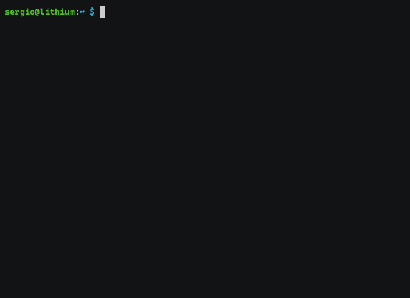

# Cup 🥤

Cup is the easiest way to check for container image updates.



## Screenshots


## Features

- Extremely fast. Cup takes full advantage of your CPU and is hightly optimized, resulting in lightning fast speed. On my test machine, it took ~6 seconds for 70 images.
- Supports most registries, including Docker Hub, ghcr.io, Quay, lscr.io and even Gitea (or derivatives)
- Doesn't exhaust any rate limits. This is the original reason I created Cup. It was inspired by [What's up docker?](https://github.com/fmartinou/whats-up-docker) which would always use it up.
- Beautiful CLI and web interface for checking on your containers any time.
- The binary is tiny! At the time of writing it's just 4.7 MB. No more pulling 100+ MB docker images for a such a simple program.
- JSON output for both the CLI and web interface so you can connect Cup to integrations. It's easy to parse and makes webhooks and pretty dashboards simple to set up!

## Installation

You can install Cup in 2 ways: as a docker container (recommended) or as a binary.

### With docker

Requirements: [Docker](https://docs.docker.com/engine/install/)

Difficulty: Easy

- Open a terminal and run `docker pull ghcr.io/sergi0g/cup`. If you're not in the `docker` group, make sure to prefix the command as root.

That's it! Now head over to the Usage section!

### From source

Requirements: [Rust](https://rustup.rs)

Difficulty: Moderate

1. Open a terminal and clone the git repository
   ```
   $ git clone https://github.com/sergi0g/cup
   ```
2. Change your directory to the repository you just cloned
   ```
   $ cd cup
   ```
3. Build Cup
   ```
   $ cargo build --release
   ```
   This will build cup with all features by default. If you want to build just the server, you can append `--no-default-features --features cli` or `--no-default-features --features server` depending one what you need.
4. Add the binary to your path for easy access

   Consult your shell's documentation on how to do this. For Bash, the following will likely work:

   ```
   $ mv /target/release/cup ~/.local/bin
   ```

   Make sure to reload your shell.

   You're now ready to use Cup!

## Usage

### CLI

Cup's CLI provides the `cup check` command.

Basic usage:

```
$ cup check
nginx:alpine                                      Update available
redis:7                                           Update available
redis:alpine                                      Update available
...
centos:7                                                Up to date
mcr.microsoft.com/devcontainers/go:0-1.19-bullseye      Up to date
rockylinux:9-minimal                                    Up to date
rabbitmq:3.11.9-management                              Up to date
...
some/deleted:image                                         Unknown
```

If you have a [Nerd Font](https://nerdfonts.com) installed, you can also add icons with the `-i` flag: `cup check -i`

If you want the output to be JSON, use the `-r` flag:

```
$ cup check -r
[{"image":"nginx:alpine","has_update":true},{"image":"rockylinux:9-minimal","has_update":false},{"image":"some/deleted:image","has_update":null}]
```

Checking a single image is also possible:

```
$ cup check node:latest
node:latest has an update available
```

If using the docker image:

```
$ docker run -v /var/run/docker.sock:/var/run/docker.sock cup check
```

### Server

The server provides the `cup serve` command.

Basic usage:

```
$ cup serve
Serving on http://0.0.0.0:8000
Received GET request on /
Received GET request on /json
```

This will launch the server on port 8000. To access it, visit `http://<YOUR_IP>:8000` (replace `<YOUR_IP>` with the IP address of the machine running Cup.)

The URL `http://<YOUR_IP>:8000/json` is also available for usage with integrations.

If you want to use a custom port, use the `-p` flag:

```
$ cup check -p 9000
Serving on http://0.0.0.0:9000
Received GET request on /
Received GET request on /json
```

If using the docker image (replace `<PORT>` with the port you're using (default 8000)):

```
$ docker run -v /var/run/docker.sock:/var/run/docker.sock -p <PORT>:<PORT> cup serve
```

## Limitations

Cup is a work in progress. It might not have as many features as What's up Docker. If one of these features is really important for you, please consider using another tool.

- Cup currently doesn't support registries which use repositories without slashes. This includes Azure. This problem may sound a bit weird, but it's due to the regex that's used at the moment. This will (hopefully) be fixed in the future.
- Cup doesn't support private images. This is on the roadmap. Currently, it just returns unknown for those images.
- Cup cannot trigger your integrations. If you want that to happen automatically, please use What's up docker instead. Cup was created to be simple. The data is there, and it's up to you to retrieve it (e.g. by running `cup check -r` with a cronjob or periodically requesting the `/json` url from the server)

## Contributing

All contributions are welcome!

Here are some ideas to get you started:

- Fix a bug from the [issues](https://github.com/sergi0g/cup/issues)
- Help improve the documentation
- Help optimize Cup and make it even better!
- Add more features to the web UI

To contribute, fork the repository, make your changes and the submit a pull request.

Note: If you update the UI, please make sure to recompile the CSS with `tailwindcss -mo src/index.css`. You need to have the Tailwind CSS CLI installed ([instructions here](https://tailwindcss.com/docs/installation))

## Support

If you have any questions about Cup, feel free to ask in the [discussions](https://github.com/sergi0g/cup/discussions)!

If you find a bug, or want to propose a feature, search for it in the [issues](https://github.com/sergi0g/cup/issues). If there isn't already an open issue, please open one.

## Acknowledgements

Thanks to [What's up Docker?](https://github.com/fmartinou/whats-up-docker) for inspiring this project.
